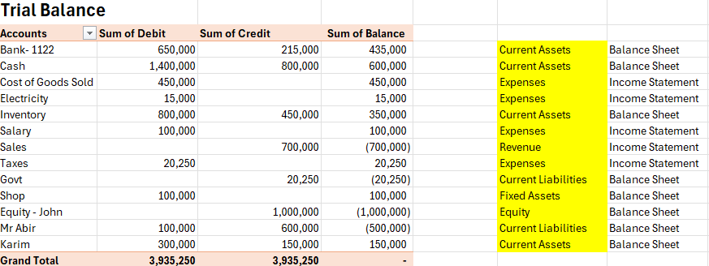
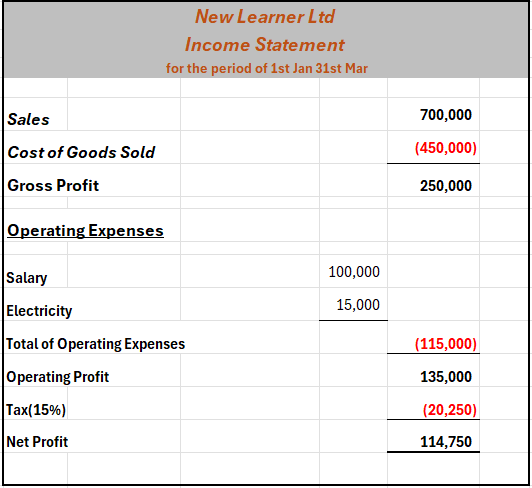

# Basic Accountancy Project in Excel

In this project I have worked on how to create Ledger, Trial Balance, Income Statement and Balance Sheet.

I gave the company name New Learner Ltd and entered some random income and expenses to create Ledger and Trial Balance.

## Ledger of New Learner Ltd

## Trial Balance of New Learner Ltd

I created the Income Statment for the period of 1st Jan 2025 to 31st Mar 2025 by getting the data from Trial Balance.

## Income Statement of New Learner Ltd

Also I have create the Balance Sheet for 31st mar 2025.

## Balance Sheet of New Learner Ltd

[Link with workbook](https://drive.google.com/file/d/1LnbVKjQvPkocipNViR3mmR_eEb4emrbj/view?usp=drive_link)

